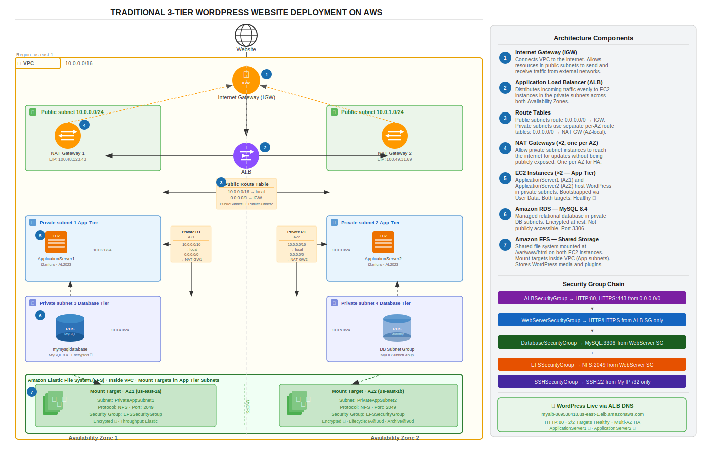

# 3-Tier WordPress Deployment on AWS

A production-style, highly available WordPress website deployed on AWS using a Traditional 3-Tier Architecture. This project demonstrates core cloud engineering skills including VPC design, multi-AZ networking, security group chaining, managed database services, shared file storage, and load balancing.

---

## Architecture Overview

```
Internet
    │
    ▼
Internet Gateway (IGW)
    │
    ▼
Application Load Balancer (ALB) — Public Subnets (AZ1 + AZ2)
    │
    ▼
EC2 Instances (WordPress) — Private App Subnets (AZ1 + AZ2)
    │              │
    ▼              ▼
Amazon RDS     Amazon EFS
(MySQL 8.4)  (Shared Storage)
Private DB Subnets
```



---

## The Three Tiers

| Tier | Component | Placement |
|---|---|---|
| **Presentation** | Application Load Balancer (ALB) | Public Subnets |
| **Application** | EC2 Instances running WordPress + Apache | Private App Subnets |
| **Data** | Amazon RDS (MySQL) + Amazon EFS | Private DB Subnets |

---

## AWS Services Used

| Service | Purpose |
|---|---|
| **Amazon VPC** | Isolated network with public and private subnets |
| **Internet Gateway (IGW)** | Internet access for public subnets |
| **NAT Gateway** | Outbound internet access for private subnet resources |
| **Application Load Balancer** | Distributes traffic across EC2 instances |
| **Amazon EC2** | Hosts the WordPress application |
| **Amazon RDS (MySQL 8.4)** | Managed relational database for WordPress data |
| **Amazon EFS** | Shared file storage for WordPress media and plugins |
| **Security Groups** | Fine-grained traffic control between tiers |
| **Route Tables** | Network routing across public and private subnets |
| **Elastic IP** | Static public IPs for NAT Gateways |
| **IAM Roles & Policies** | Secure service interaction |
| **AWS CloudFormation** | Infrastructure as Code — full stack reproducible deployment |

---

## Network Design

### VPC

| Setting | Value |
|---|---|
| VPC Name | 3-Tier-webapp |
| IPv4 CIDR | 10.0.0.0/16 |
| DNS Resolution | Enabled |
| DNS Hostnames | Enabled |

> DNS hostnames are explicitly enabled — required for RDS endpoint resolution and EFS mount targets to work correctly within the VPC.

### Subnets

| Subnet Name | CIDR | Availability Zone | Type |
|---|---|---|---|
| PublicSubnet1 | 10.0.0.0/24 | us-east-1a | Public |
| PublicSubnet2 | 10.0.1.0/24 | us-east-1b | Public |
| PrivateAppSubnet1 | 10.0.2.0/24 | us-east-1a | Private |
| PrivateAppSubnet2 | 10.0.3.0/24 | us-east-1b | Private |
| PrivateDBSubnet1 | 10.0.4.0/24 | us-east-1a | Private |
| PrivateDBSubnet2 | 10.0.5.0/24 | us-east-1b | Private |

Each /24 subnet provides 251 usable IP addresses — appropriate for this workload while keeping the design clean and readable.

### Route Tables

| Route Table | Subnets | Routes |
|---|---|---|
| PublicRouteTable | PublicSubnet1, PublicSubnet2 | 0.0.0.0/0 → IGW |
| PrivateRouteTableAZ1 | PrivateAppSubnet1, PrivateDBSubnet1 | 0.0.0.0/0 → NATGateway1 |
| PrivateRouteTableAZ2 | PrivateAppSubnet2, PrivateDBSubnet2 | 0.0.0.0/0 → NATGateway2 |

Two separate private route tables are used — one per AZ — so that a NAT Gateway failure in one AZ does not affect the other. This is a key AWS Well-Architected principle for AZ-level fault isolation.

### NAT Gateways

Two NAT Gateways are deployed — one in each public subnet — each with a dedicated Elastic IP. This ensures private subnet resources in both AZs can reach the internet independently for package installs and WordPress updates, without being publicly exposed.

> **Cost note:** NAT Gateways incur hourly charges. For this portfolio project, Zonal mode is used over the newer Regional mode to maintain AZ-level isolation aligned with the separate private route table design.

---

## Security Group Design

Security groups are chained using SG references (not CIDR ranges) to enforce least-privilege access between tiers.

| Security Group | Inbound Port | Source | Purpose |
|---|---|---|---|
| ALBSecurityGroup | 80, 443 | 0.0.0.0/0 | Public web traffic to ALB |
| WebServerSecurityGroup | 80, 443 | ALBSecurityGroup | App tier — only ALB can reach EC2 |
| WebServerSecurityGroup | 22 | SSHSecurityGroup | Admin SSH access |
| DatabaseSecurityGroup | 3306 | WebServerSecurityGroup | MySQL — only app tier can reach RDS |
| EFSSecurityGroup | 2049 | WebServerSecurityGroup | NFS mount — only app tier can mount EFS |
| EFSSecurityGroup | 2049 | EFSSecurityGroup (self) | EFS mount targets communicate across AZs |
| SSHSecurityGroup | 22 | My IP /32 | Restricted SSH — single IP only |

> No security group exposes ports directly from the internet except the ALB on ports 80/443. The database and file system are never internet-accessible.

---

## Database Layer

### RDS MySQL

| Setting | Value |
|---|---|
| Engine | MySQL Community 8.4.7 |
| Instance Class | db.t4g.micro |
| Storage | 20 GiB gp2 (autoscaling up to 1000 GiB) |
| Encryption | Enabled (AWS managed KMS key) |
| Publicly Accessible | No |
| DB Subnet Group | PrivateDBSubnet1 + PrivateDBSubnet2 |

> **Trade-offs for free tier:** Multi-AZ is disabled (would double cost) and Performance Insights is disabled. In a production environment, both would be enabled. Encryption is enabled regardless of tier.

### Amazon EFS

| Setting | Value |
|---|---|
| Performance Mode | General Purpose |
| Throughput Mode | Elastic |
| Encryption | Enabled |
| Lifecycle Management | IA after 30 days, Archive after 90 days |
| Mount Targets | PrivateAppSubnet1 (AZ1), PrivateAppSubnet2 (AZ2) |

EFS is mounted at `/var/www/html` on both EC2 instances, providing a shared WordPress file system (media, plugins, themes) across the app tier. Mount targets are placed in the app tier subnets — not the DB subnets — so EC2 instances can access them directly.

---

## Compute & Application Layer

### Bastion / Setup EC2 Instance

A temporary EC2 instance (`Webserver-Instance`) is launched in `PublicSubnet1` to:
- SSH into private instances via the bastion pattern
- Perform initial WordPress configuration against the RDS endpoint
- Verify the setup before terminating

This instance is **terminated** after setup is confirmed working. It is not part of the final production architecture.

### Application EC2 Instances

| Setting | Value |
|---|---|
| Instances | ApplicationServer1 (AZ1), ApplicationServer2 (AZ2) |
| AMI | Amazon Linux 2023 |
| Instance Type | t2.micro |
| Subnet | PrivateAppSubnet1, PrivateAppSubnet2 |
| Auto-assign Public IP | Disabled |
| Security Group | WebServerSecurityGroup |

Both instances are bootstrapped via **User Data script** at launch — no manual SSH required.

### User Data Script

See [`scripts/user-data.sh`](scripts/user-data.sh)

The script automates:
- System update
- Apache + mod_ssl installation and startup
- PHP and required extensions installation
- MySQL client installation
- EFS mount to `/var/www/html`
- Apache restart

> Note: Replace the EFS DNS in the script with your own EFS filesystem DNS before use.

---

## Load Balancer

| Setting | Value |
|---|---|
| Type | Application Load Balancer (ALB) |
| Name | MyALB |
| Scheme | Internet-facing |
| Subnets | PublicSubnet1 (AZ1), PublicSubnet2 (AZ2) |
| Security Group | ALBSecurityGroup |
| Listener | HTTP:80 → Forward to MyAppServers |
| Target Group | MyAppServers (Instance type, HTTP:80) |
| Targets | ApplicationServer1 ✅ Healthy, ApplicationServer2 ✅ Healthy |

> **Known limitation:** This project uses HTTP only. In a production environment, an ACM certificate would be added, HTTPS:443 listener enabled, and HTTP redirected to HTTPS.

After ALB creation, the WordPress Site URL and Address are updated to the ALB DNS name via **Settings → General** in the WordPress admin panel to ensure correct redirects.

---

## Deployment Steps

1. Create VPC with DNS resolution and DNS hostnames enabled
2. Create and attach Internet Gateway
3. Create 6 subnets across 2 Availability Zones
4. Create route tables and associate with subnets
5. Allocate Elastic IPs and create 2 NAT Gateways (one per AZ)
6. Add NAT Gateway routes to private route tables
7. Create Security Groups with SG-to-SG chaining
8. Create RDS DB Subnet Group and MySQL instance
9. Create EFS with mount targets in app tier subnets
10. Launch setup EC2 in public subnet, install WordPress, configure RDS connection
11. Launch 2 private EC2 instances with User Data script
12. Create ALB, target group, register EC2 instances
13. Update WordPress URLs to ALB DNS name
14. Verify healthy targets and WordPress accessible via ALB
15. Terminate setup EC2 instance

---

## Key Design Decisions

**Why two NAT Gateways?**
One NAT Gateway per AZ ensures private subnet resources in AZ1 and AZ2 each have independent outbound internet access. A single NAT Gateway creates an AZ-level single point of failure.

**Why SG chaining instead of CIDR rules?**
Using security group IDs as sources (instead of IP ranges) means rules automatically track membership — if an instance is added to a security group, it immediately inherits the correct access without any rule changes.

**Why EFS instead of local storage?**
WordPress running across two EC2 instances requires a shared file system for media uploads, plugins, and themes. Without EFS, files uploaded to one instance would be invisible to the other. EFS mount targets in each AZ ensure low-latency access from both instances.

**Why a temporary bastion host?**
EC2 instances in private subnets have no direct internet access. A temporary public EC2 (bastion) allows SSH tunnelling into private instances for initial setup. It is terminated immediately after setup, reducing attack surface.

---

## Deploy with CloudFormation

The entire infrastructure can be reproduced automatically using the provided CloudFormation template — no manual console steps required.

**Template:** [`cloudformation/cloudformation-3tier-wordpress.yaml`](cloudformation/cloudformation-3tier-wordpress.yaml)

### What it provisions

All resources in this project are defined in the template including VPC, subnets, route tables, NAT Gateways, security groups, EFS, RDS, EC2 instances, ALB, and target group — fully wired together.

### Steps to deploy

**1. Open CloudFormation**
- Log into AWS Console → search **CloudFormation** → ensure you are in **us-east-1**

**2. Create Stack**
- Click **Create stack → With new resources (standard)**
- Select **Upload a template file**
- Upload `cloudformation-3tier-wordpress.yaml`
- Click **Next**

**3. Fill in Parameters**

| Parameter | Description |
|---|---|
| ProjectName | Stack identifier (default: 3-Tier-webapp) |
| KeyPairName | Your existing EC2 key pair name |
| SSHAllowedIP | Your IP address in x.x.x.x/32 format |
| DBName | WordPress database name |
| DBUsername | RDS master username |
| DBPassword | RDS master password (min 8 characters) |
| DBInstanceClass | RDS instance class (default: db.t4g.micro) |
| InstanceType | EC2 instance type (default: t2.micro) |

**4. Deploy**
- Stack name: `3-tier-wordpress-stack`
- Click through to **Submit**
- Monitor progress in the **Events** tab
- Full deployment takes approximately **15–20 minutes** (RDS takes longest)

**5. Get Outputs**

Once status shows **CREATE_COMPLETE**, click the **Outputs** tab to find:

| Output | Description |
|---|---|
| WordPressURL | Click to open WordPress setup wizard |
| WordPressAdminURL | WordPress admin panel |
| RDSEndpoint | Use as DB_HOST in wp-config.php |
| ALBDNSName | Load balancer DNS name |
| EFSFileSystemId | EFS filesystem ID |

**6. Complete WordPress Setup**
- Navigate to the **WordPressURL** output value
- Complete the WordPress installation wizard
- Update **Settings → General** and set both WordPress Address and Site Address to the ALB DNS name

> ⚠️ **Cost Warning:** NAT Gateways and RDS incur hourly charges. Delete the stack when done — CloudFormation will automatically clean up all resources.
> To delete: CloudFormation → select stack → Delete

---

## Screenshots

Step-by-step console screenshots are organised in the [`screenshots/`](screenshots/) directory.

---

## Author

**Chathura Dandeniya**
AWS Solutions Architect Associate | CKA | Terraform Associate
[LinkedIn](https://www.linkedin.com/in/chathura-dandeniya) | [GitHub](https://github.com/chathura-dandeniya)
